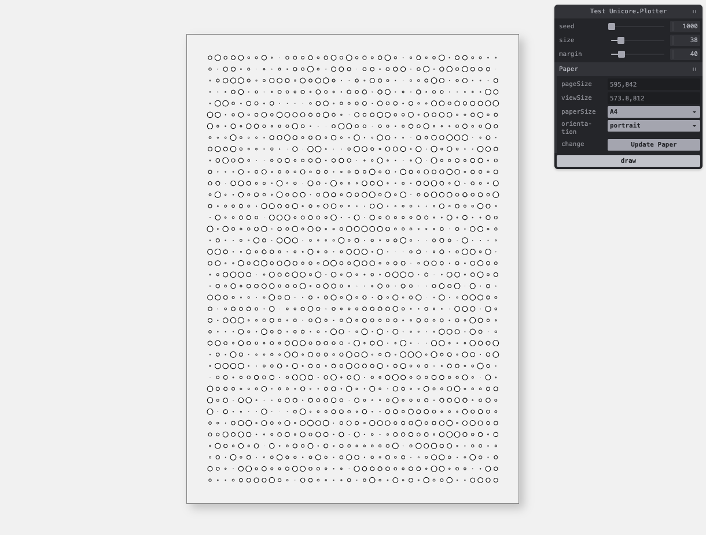

# Unicore Plotter

Welcome to Unicore.Plotter ✨ This monorepo aims to provide myself some foundation for creating pen plotter art, supporting initiatives like [#ptpx](https://bsky.app/search?q=ptpx), and [#plotparty](https://bsky.app/hashtag/PlotParty).

**Disclaimer**: This is a preliminary work in progress. Expect rough edges, half-baked ideas, and the occasional "what were they thinking?" moment. But hey, that’s part of the charm!

---

## What’s Inside the Box?



This repo has some *bad* ideas about how to do pen plotting. Here’s what it currently offers:

### Highlights:
- **Paper**: it creates your canvas, based off paper size.
- **Declarative Tweakpane**: a wrapper for [tweakpane](https://github.com/cocopon/tweakpane) library featuring a declarative way of defining ui.
- **Examples**: Examples on how to create a pen plot.

---

## Getting Started

1. **Install Dependencies**
   ```bash
   yarn install
   ```

2. **Choose Your Path**
   - Ready to create your masterpiece? Head to `apps/sketches/` and start by duplicating the template folder `apps/sketches/test/`.
   - Want to explore existing packages? Check out the packages in  `packages/**`


3. **Run the Thing**
   ```bash
   yarn start
   ```

Open your browser, select your sketch (e.g., `http://localhost:1234/mynewsketch`), and let the creative flow unfold.